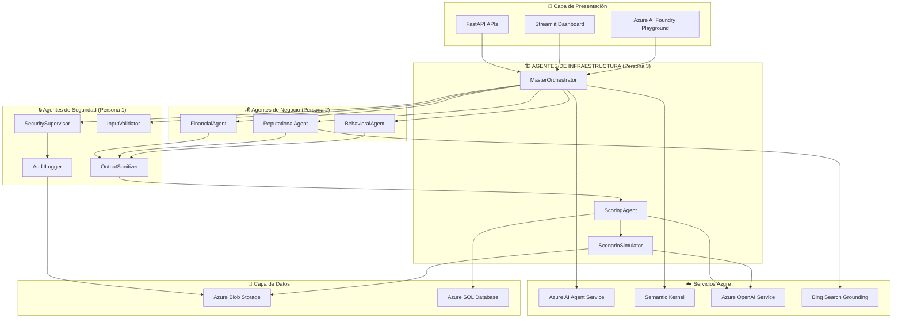

# Documento de Diseño - Agentes de Infraestructura

## Visión General

Los Agentes de Infraestructura forman la capa de coordinación crítica del Sistema de Evaluación Inteligente de Riesgo Financiero para PYMEs. Estos 3 agentes especializados (MasterOrchestrator, ScoringAgent, ScenarioSimulator) orquestan y consolidan el trabajo de los otros 7 agentes especializados desarrollados por el equipo.

El sistema utiliza tecnologías Azure para proporcionar coordinación inteligente, consolidación de resultados, y capacidades de simulación de escenarios financieros, integrándose perfectamente con la arquitectura multiagente existente.

## Arquitectura

### Arquitectura de Alto Nivel



### Arquitectura de Agentes de Infraestructura

Los 3 agentes de infraestructura siguen un patrón de coordinación específico:

#### 1. MasterOrchestrator (Coordinador Central)
- **Entrada**: Solicitudes de evaluación de riesgo desde APIs/UI
- **Procesamiento**: Coordina secuencia de agentes de seguridad → negocio → consolidación
- **Salida**: Resultados consolidados para ScoringAgent

#### 2. ScoringAgent (Consolidador de Resultados)
- **Entrada**: Resultados de FinancialAgent, ReputationalAgent, BehavioralAgent
- **Procesamiento**: Consolidación inteligente y generación de scoring 0-1000
- **Salida**: Scoring final con explicabilidad y clasificación de riesgo

#### 3. ScenarioSimulator (Simulador de Escenarios)
- **Entrada**: Parámetros de simulación y datos base de la empresa
- **Procesamiento**: Modificación de variables y recálculo de scoring
- **Salida**: Comparación de escenarios y recomendaciones

## Componentes e Interfaces

### 1. MasterOrchestrator - Coordinador Central

**Propósito**: Coordina el flujo completo de evaluación de riesgo entre todos los agentes especializados

**Componentes Clave**:
- **Workflow Manager**: Gestiona la secuencia de ejecución de agentes
- **Agent Coordinator**: Coordina comunicación entre agentes de seguridad, negocio e infraestructura
- **State Manager**: Mantiene el estado de la evaluación a través del flujo completo
- **Error Handler**: Maneja fallos de agentes con degradación graceful

**Interfaces**:
```python
class MasterOrchestrator:
    def __init__(self, azure_ai_service: AzureAIService, semantic_kernel: SemanticKernel):
        self.azure_ai = azure_ai_service
        self.kernel = semantic_kernel
        self.workflow_manager = WorkflowManager()
        self.state_manager = StateManager()
    
    def start_risk_evaluation(self, company_data: CompanyData) -> str:
        """Inicia una nueva evaluación de riesgo"""
        pass
    
    def coordinate_security_agents(self, evaluation_id: str) -> SecurityResults:
        """Coordina agentes de seguridad (InputValidator, SecuritySupervisor)"""
        pass
    
    def coordinate_business_agents(self, evaluation_id: str, validated_data: dict) -> BusinessResults:
        """Coordina agentes de negocio (Financial, Reputational, Behavioral)"""
        pass
    
    def handle_agent_failure(self, agent_id: str, error: Exception) -> FailureResponse:
        """Maneja fallos de agentes individuales"""
        pass
    
    def get_evaluation_status(self, evaluation_id: str) -> EvaluationStatus:
        """Obtiene el estado actual de una evaluación"""
        pass
```

### 2. ScoringAgent - Consolidador de Resultados

**Propósito**: Consolida resultados de todos los agentes de negocio y genera scoring final de riesgo

**Componentes Clave**:
- **Result Consolidator**: Consolida análisis de FinancialAgent, ReputationalAgent, BehavioralAgent
- **Scoring Engine**: Genera scoring 0-1000 basado en algoritmos de riesgo
- **Explainability Engine**: Proporciona explicación detallada de factores contribuyentes
- **Risk Classifier**: Clasifica riesgo como Alto, Medio, o Bajo

**Interfaces**:
```python
class ScoringAgent:
    def __init__(self, azure_openai: AzureOpenAI, sql_database: AzureSQLDatabase):
        self.openai = azure_openai
        self.database = sql_database
        self.consolidator = ResultConsolidator()
        self.scoring_engine = ScoringEngine()
        self.explainer = ExplainabilityEngine()
    
    def consolidate_business_results(self, financial_result: dict, 
                                   reputational_result: dict, 
                                   behavioral_result: dict) -> ConsolidatedResult:
        """Consolida resultados de los 3 agentes de negocio"""
        pass
    
    def generate_risk_score(self, consolidated_data: ConsolidatedResult) -> RiskScore:
        """Genera scoring final 0-1000 con explicabilidad"""
        pass
    
    def classify_risk_level(self, score: float) -> RiskLevel:
        """Clasifica riesgo: Alto (0-300), Medio (301-700), Bajo (701-1000)"""
        pass
    
    def generate_credit_recommendation(self, risk_score: RiskScore) -> CreditRecommendation:
        """Genera recomendación de límite de crédito"""
        pass
    
    def validate_score_consistency(self, score: RiskScore, source_data: dict) -> ValidationResult:
        """Valida consistencia del scoring con datos fuente"""
        pass
```

### 3. ScenarioSimulator - Simulador de Escenarios

**Propósito**: Permite simulaciones "qué pasaría si" modificando variables clave de la empresa

**Componentes Clave**:
- **Variable Manager**: Gestiona variables modificables (ventas, reputación, ratios)
- **Scenario Engine**: Ejecuta simulaciones con parámetros modificados
- **Comparison Engine**: Compara múltiples escenarios y genera insights
- **Validation Engine**: Valida viabilidad de escenarios simulados

**Interfaces**:
```python
class ScenarioSimulator:
    def __init__(self, azure_openai: AzureOpenAI, blob_storage: AzureBlobStorage):
        self.openai = azure_openai
        self.storage = blob_storage
        self.variable_manager = VariableManager()
        self.scenario_engine = ScenarioEngine()
        self.comparison_engine = ComparisonEngine()
    
    def get_modifiable_variables(self, company_data: CompanyData) -> List[ModifiableVariable]:
        """Obtiene lista de variables que se pueden modificar"""
        pass
    
    def create_scenario(self, base_data: CompanyData, 
                       variable_changes: Dict[str, Any]) -> Scenario:
        """Crea un nuevo escenario con variables modificadas"""
        pass
    
    def simulate_scenario(self, scenario: Scenario) -> SimulationResult:
        """Ejecuta simulación y recalcula scoring usando ScoringAgent"""
        pass
    
    def compare_scenarios(self, scenarios: List[Scenario]) -> ComparisonResult:
        """Compara múltiples escenarios y genera recomendaciones"""
        pass
    
    def validate_scenario_viability(self, scenario: Scenario) -> ValidationResult:
        """Valida si el escenario es estadísticamente viable"""
        pass
    
    def save_simulation_history(self, simulation: SimulationResult) -> str:
        """Guarda historial de simulación para auditoría"""
        pass
```

### 4. Integración con Servicios Azure

#### Azure AI Agent Service
**Propósito**: Servicio base para orquestación de agentes especializados

**Configuración**:
```python
class AzureAIAgentService:
    def __init__(self, subscription_id: str, resource_group: str):
        self.client = AIAgentServiceClient(subscription_id, resource_group)
        self.agent_registry = AgentRegistry()
    
    def register_infrastructure_agents(self) -> None:
        """Registra los 3 agentes de infraestructura"""
        pass
    
    def create_workflow(self, workflow_definition: WorkflowDefinition) -> str:
        """Crea workflow de evaluación de riesgo"""
        pass
```

#### Semantic Kernel Integration
**Propósito**: Framework ligero para gestión de contexto y memoria de agentes

**Configuración**:
```python
class SemanticKernelManager:
    def __init__(self, azure_openai_endpoint: str):
        self.kernel = Kernel()
        self.memory = VolatileMemoryStore()
        self.planner = SequentialPlanner(self.kernel)
    
    def setup_infrastructure_plugins(self) -> None:
        """Configura plugins para agentes de infraestructura"""
        pass
    
    def manage_evaluation_context(self, evaluation_id: str, context_data: dict) -> None:
        """Gestiona contexto de evaluación a través del flujo"""
        pass
```

### 5. Almacenamiento y Persistencia

#### Azure Blob Storage
**Propósito**: Almacenamiento seguro para reportes, simulaciones y configuraciones

**Organización de Almacenamiento**:
```
/risk-evaluations/
  /reports/
    /{evaluation_id}/
      /final_report.docx
      /scoring_details.json
  /simulations/
    /{evaluation_id}/
      /scenario_{scenario_id}.json
      /comparison_results.json
/configurations/
  /agent_configs/
    /master_orchestrator.json
    /scoring_agent.json
    /scenario_simulator.json
/audit_logs/
  /orchestration_logs/
  /scoring_logs/
  /simulation_logs/
```

#### Azure SQL Database Schema
**Propósito**: Almacenamiento estructurado para datos de evaluación y scoring

**Tablas Clave**:
```sql
-- Tabla de evaluaciones de riesgo
CREATE TABLE RiskEvaluations (
    evaluation_id NVARCHAR(50) PRIMARY KEY,
    company_id NVARCHAR(50) NOT NULL,
    status NVARCHAR(20) NOT NULL,
    final_score FLOAT,
    risk_level NVARCHAR(10),
    created_date DATETIME2 DEFAULT GETDATE(),
    completed_date DATETIME2
);

-- Tabla de resultados de agentes
CREATE TABLE AgentResults (
    result_id NVARCHAR(50) PRIMARY KEY,
    evaluation_id NVARCHAR(50) FOREIGN KEY REFERENCES RiskEvaluations(evaluation_id),
    agent_name NVARCHAR(50) NOT NULL,
    result_data NVARCHAR(MAX),
    confidence_score FLOAT,
    processing_time_ms INT,
    created_date DATETIME2 DEFAULT GETDATE()
);

-- Tabla de simulaciones de escenarios
CREATE TABLE ScenarioSimulations (
    simulation_id NVARCHAR(50) PRIMARY KEY,
    evaluation_id NVARCHAR(50) FOREIGN KEY REFERENCES RiskEvaluations(evaluation_id),
    scenario_name NVARCHAR(100),
    variable_changes NVARCHAR(MAX),
    simulated_score FLOAT,
    impact_analysis NVARCHAR(MAX),
    created_date DATETIME2 DEFAULT GETDATE()
);

-- Tabla de scoring detallado
CREATE TABLE ScoringDetails (
    scoring_id NVARCHAR(50) PRIMARY KEY,
    evaluation_id NVARCHAR(50) FOREIGN KEY REFERENCES RiskEvaluations(evaluation_id),
    financial_score FLOAT,
    reputational_score FLOAT,
    behavioral_score FLOAT,
    final_score FLOAT,
    explanation NVARCHAR(MAX),
    contributing_factors NVARCHAR(MAX),
    created_date DATETIME2 DEFAULT GETDATE()
);
```

## Modelos de Datos

### Modelos de Datos Principales

```python
from dataclasses import dataclass
from datetime import datetime
from typing import List, Dict, Any, Optional
from enum import Enum

class EvaluationStatus(Enum):
    PENDING = "pending"
    IN_PROGRESS = "in_progress"
    SECURITY_VALIDATION = "security_validation"
    BUSINESS_ANALYSIS = "business_analysis"
    SCORING = "scoring"
    COMPLETED = "completed"
    FAILED = "failed"

class RiskLevel(Enum):
    ALTO = "alto"      # 0-300
    MEDIO = "medio"    # 301-700
    BAJO = "bajo"      # 701-1000

@dataclass
class CompanyData:
    """Datos de entrada de la empresa para evaluación"""
    company_id: str
    company_name: str
    financial_statements: Dict[str, Any]
    social_media_data: Dict[str, Any]
    commercial_references: List[Dict[str, Any]]
    payment_history: Dict[str, Any]
    metadata: Dict[str, Any]

@dataclass
class SecurityResults:
    """Resultados de agentes de seguridad"""
    input_validation_result: Dict[str, Any]
    security_supervisor_result: Dict[str, Any]
    validation_passed: bool
    security_alerts: List[str]
    processing_time: float

@dataclass
class BusinessResults:
    """Resultados consolidados de agentes de negocio"""
    financial_analysis: Dict[str, Any]
    reputational_analysis: Dict[str, Any]
    behavioral_analysis: Dict[str, Any]
    confidence_scores: Dict[str, float]
    processing_times: Dict[str, float]

@dataclass
class ConsolidatedResult:
    """Resultado consolidado para scoring"""
    financial_score: float
    reputational_score: float
    behavioral_score: float
    weighted_factors: Dict[str, float]
    confidence_level: float
    data_quality_score: float

@dataclass
class RiskScore:
    """Scoring final de riesgo"""
    score: float  # 0-1000
    risk_level: RiskLevel
    confidence: float
    explanation: str
    contributing_factors: List[Dict[str, Any]]
    recommended_credit_limit: Optional[float]
    timestamp: datetime

@dataclass
class ModifiableVariable:
    """Variable que se puede modificar en simulaciones"""
    name: str
    current_value: Any
    variable_type: str  # 'financial', 'reputational', 'behavioral'
    min_value: Optional[float]
    max_value: Optional[float]
    description: str

@dataclass
class Scenario:
    """Escenario de simulación"""
    scenario_id: str
    scenario_name: str
    base_company_data: CompanyData
    variable_changes: Dict[str, Any]
    created_date: datetime

@dataclass
class SimulationResult:
    """Resultado de simulación de escenario"""
    simulation_id: str
    scenario: Scenario
    original_score: RiskScore
    simulated_score: RiskScore
    impact_analysis: Dict[str, Any]
    recommendations: List[str]
    viability_score: float
    processing_time: float

@dataclass
class ComparisonResult:
    """Resultado de comparación de escenarios"""
    comparison_id: str
    scenarios: List[SimulationResult]
    best_scenario: str
    worst_scenario: str
    key_insights: List[str]
    recommendations: List[str]

@dataclass
class EvaluationStatus:
    """Estado de una evaluación de riesgo"""
    evaluation_id: str
    company_id: str
    status: EvaluationStatus
    current_agent: Optional[str]
    progress_percentage: float
    estimated_completion: Optional[datetime]
    error_messages: List[str]
    last_updated: datetime

@dataclass
class CreditRecommendation:
    """Recomendación de crédito"""
    recommended_limit: float
    interest_rate_suggestion: float
    terms_conditions: List[str]
    risk_mitigation_measures: List[str]
    monitoring_requirements: List[str]
```

## Manejo de Errores

### Categorías de Errores y Estrategias

1. **Errores de Coordinación de Agentes (MasterOrchestrator)**
   - Fallos en agentes de seguridad o negocio durante el flujo
   - Estrategia: Aislamiento de fallos con degradación graceful
   - Continuación del flujo con agentes disponibles

2. **Errores de Consolidación (ScoringAgent)**
   - Inconsistencias entre resultados de agentes de negocio
   - Datos insuficientes para generar scoring confiable
   - Estrategia: Validación cruzada y alertas de calidad de datos

3. **Errores de Simulación (ScenarioSimulator)**
   - Escenarios estadísticamente inviables
   - Fallos en recálculo de scoring
   - Estrategia: Validación de viabilidad y fallback a datos base

4. **Errores de Servicios Azure**
   - Conectividad con Azure OpenAI Service, SQL Database, Blob Storage
   - Límites de rate en APIs de Azure
   - Estrategia: Circuit breaker con reintentos exponenciales

### Implementación de Manejo de Errores

```python
class InfrastructureErrorHandler:
    def __init__(self):
        self.circuit_breakers = {}
        self.retry_policies = {}
        self.audit_logger = AuditLogger()
    
    def handle_orchestration_error(self, evaluation_id: str, 
                                 failed_agent: str, 
                                 error: Exception) -> OrchestrationResponse:
        """Maneja errores en la coordinación de agentes"""
        if isinstance(error, AgentTimeoutError):
            return self.handle_agent_timeout(evaluation_id, failed_agent)
        elif isinstance(error, SecurityValidationError):
            return self.handle_security_failure(evaluation_id, error)
        else:
            return self.escalate_orchestration_error(evaluation_id, failed_agent, error)
    
    def handle_scoring_inconsistency(self, evaluation_id: str, 
                                   business_results: BusinessResults) -> ScoringResponse:
        """Maneja inconsistencias en resultados de agentes de negocio"""
        confidence_threshold = 0.7
        low_confidence_agents = [
            agent for agent, confidence in business_results.confidence_scores.items()
            if confidence < confidence_threshold
        ]
        
        if len(low_confidence_agents) > 1:
            return self.request_additional_validation(evaluation_id, low_confidence_agents)
        else:
            return self.proceed_with_weighted_scoring(evaluation_id, business_results)
    
    def handle_simulation_error(self, scenario: Scenario, 
                              error: Exception) -> SimulationResponse:
        """Maneja errores en simulación de escenarios"""
        if isinstance(error, InvalidScenarioError):
            return self.validate_and_suggest_alternatives(scenario)
        elif isinstance(error, ScoringRecalculationError):
            return self.fallback_to_baseline_scoring(scenario)
        else:
            return self.log_and_skip_scenario(scenario, error)
    
    def handle_azure_service_error(self, service_name: str, 
                                 operation: str, 
                                 error: Exception) -> ServiceResponse:
        """Maneja errores de servicios Azure"""
        circuit_breaker = self.circuit_breakers.get(service_name)
        
        if isinstance(error, RateLimitError):
            return self.apply_rate_limiting(service_name, operation)
        elif isinstance(error, ConnectionError):
            return circuit_breaker.handle_failure(operation, error)
        elif isinstance(error, AuthenticationError):
            return self.refresh_credentials_and_retry(service_name, operation)
        else:
            return self.escalate_service_error(service_name, operation, error)
    
    def apply_circuit_breaker(self, service: str, operation: str) -> ServiceResponse:
        """Implementa patrón circuit breaker para servicios Azure"""
        breaker = self.circuit_breakers.get(service)
        if breaker.is_open():
            return ServiceResponse(
                success=False,
                message=f"Circuit breaker open for {service}",
                fallback_available=True
            )
        return breaker.call(operation)
    
    def log_infrastructure_error(self, error_context: Dict[str, Any]) -> None:
        """Registra errores de infraestructura para auditoría"""
        self.audit_logger.log_error(
            error_type="infrastructure_error",
            context=error_context,
            timestamp=datetime.now(),
            severity="high" if error_context.get("critical", False) else "medium"
        )
```

## Estrategia de Testing

### Niveles de Testing

1. **Testing Unitario de Agentes de Infraestructura**
   - Funcionalidad individual de MasterOrchestrator, ScoringAgent, ScenarioSimulator
   - Validación de modelos de datos específicos del dominio financiero
   - Integración con servicios Azure (OpenAI, SQL Database, Blob Storage)
   - Objetivo de cobertura: 90%

2. **Testing de Integración Multiagente**
   - Comunicación entre agentes de infraestructura y agentes de seguridad/negocio
   - Flujo completo de evaluación de riesgo end-to-end
   - Persistencia de datos en Azure SQL Database y Blob Storage
   - Validación de scoring y simulaciones de escenarios

3. **Testing de Rendimiento Financiero**
   - Carga de múltiples evaluaciones de riesgo concurrentes (objetivo: 100+ evaluaciones/hora)
   - Stress testing con datos financieros complejos
   - Latencia de scoring y simulaciones (objetivo: < 5 minutos por evaluación)
   - Escalabilidad de simulaciones de escenarios múltiples

4. **Testing de Seguridad Financiera**
   - Validación de manejo seguro de datos financieros sensibles
   - Testing de proxy de seguridad con Azure OpenAI
   - Verificación de aislamiento de datos entre empresas
   - Auditoría y trazabilidad de evaluaciones de riesgo

### Herramientas y Frameworks de Testing

- **pytest**: Framework principal para testing de componentes Python
- **Azure AI Foundry Playground**: Testing visual y prototipado de agentes
- **Streamlit Dashboard**: Monitoreo en tiempo real y debugging de evaluaciones
- **Azure Load Testing**: Testing de rendimiento y escalabilidad
- **PyODBC Testing**: Validación de conectividad y operaciones de base de datos
- **Spire.Doc.Free Testing**: Validación de generación de reportes Word

### Casos de Testing Específicos

#### Testing del MasterOrchestrator
```python
class TestMasterOrchestrator:
    def test_risk_evaluation_workflow(self):
        """Prueba el flujo completo de evaluación de riesgo"""
        # Simular datos de empresa PYME
        company_data = create_mock_pyme_data()
        
        # Ejecutar evaluación
        evaluation_id = orchestrator.start_risk_evaluation(company_data)
        
        # Verificar coordinación de agentes
        assert evaluation_id is not None
        assert orchestrator.get_evaluation_status(evaluation_id).status == EvaluationStatus.IN_PROGRESS
    
    def test_agent_failure_handling(self):
        """Prueba manejo de fallos de agentes individuales"""
        # Simular fallo de FinancialAgent
        with mock.patch('agents.FinancialAgent.analyze') as mock_financial:
            mock_financial.side_effect = AgentTimeoutError()
            
            # Verificar degradación graceful
            result = orchestrator.coordinate_business_agents(evaluation_id, validated_data)
            assert result.partial_results is True
            assert 'financial_agent_timeout' in result.warnings
```

#### Testing del ScoringAgent
```python
class TestScoringAgent:
    def test_scoring_consolidation(self):
        """Prueba consolidación de resultados de agentes de negocio"""
        # Datos mock de agentes de negocio
        financial_result = create_mock_financial_analysis()
        reputational_result = create_mock_reputational_analysis()
        behavioral_result = create_mock_behavioral_analysis()
        
        # Consolidar resultados
        consolidated = scoring_agent.consolidate_business_results(
            financial_result, reputational_result, behavioral_result
        )
        
        # Verificar consolidación
        assert 0 <= consolidated.financial_score <= 1000
        assert consolidated.confidence_level > 0.7
    
    def test_risk_classification(self):
        """Prueba clasificación de riesgo según scoring"""
        # Testing de clasificación Alto
        assert scoring_agent.classify_risk_level(150) == RiskLevel.ALTO
        
        # Testing de clasificación Medio
        assert scoring_agent.classify_risk_level(500) == RiskLevel.MEDIO
        
        # Testing de clasificación Bajo
        assert scoring_agent.classify_risk_level(850) == RiskLevel.BAJO
```

#### Testing del ScenarioSimulator
```python
class TestScenarioSimulator:
    def test_scenario_simulation(self):
        """Prueba simulación de escenarios financieros"""
        # Crear escenario con mejora en ventas
        scenario = simulator.create_scenario(
            base_company_data,
            {"monthly_sales": 150000, "reputation_score": 0.8}
        )
        
        # Ejecutar simulación
        result = simulator.simulate_scenario(scenario)
        
        # Verificar impacto positivo en scoring
        assert result.simulated_score.score > result.original_score.score
        assert result.viability_score > 0.8
    
    def test_invalid_scenario_detection(self):
        """Prueba detección de escenarios inviables"""
        # Crear escenario estadísticamente imposible
        invalid_scenario = simulator.create_scenario(
            base_company_data,
            {"monthly_sales": -50000}  # Ventas negativas
        )
        
        # Verificar detección de invalidez
        validation = simulator.validate_scenario_viability(invalid_scenario)
        assert validation.is_valid is False
        assert "negative_sales" in validation.issues
```

### Estrategia de Entornos de Testing

1. **Entorno de Desarrollo**
   - Desarrollo local con servicios Azure mockeados
   - Testing unitario e integración básica
   - Datos de PYMEs sintéticos para testing
   - Iteración rápida y debugging

2. **Entorno de Staging**
   - Integración completa con servicios Azure reales
   - Testing end-to-end con datos realistas de PYMEs ecuatorianas
   - Validación de rendimiento y escalabilidad
   - Testing de seguridad y compliance

3. **Entorno de Producción**
   - Monitoreo continuo de evaluaciones de riesgo
   - Alertas automáticas para fallos de agentes
   - Health checks de servicios Azure
   - Métricas de precisión de scoring en tiempo real

### Pipeline de CI/CD para Agentes de Infraestructura

```yaml
# Pipeline específico para agentes de infraestructura
name: Infrastructure Agents CI/CD

stages:
  - test:
      unit_tests:
        - test_master_orchestrator
        - test_scoring_agent
        - test_scenario_simulator
      integration_tests:
        - test_multiagent_workflow
        - test_azure_services_integration
        - test_database_operations
      security_tests:
        - test_financial_data_isolation
        - test_azure_openai_proxy
        - test_audit_trail_integrity
      performance_tests:
        - test_concurrent_evaluations
        - test_scoring_latency
        - test_simulation_throughput
  
  - build:
      docker_build:
        - infrastructure_agents_image
      artifact_creation:
        - agent_configurations
        - database_schemas
        - api_documentation
  
  - deploy:
      staging_deployment:
        - deploy_to_azure_staging
        - run_integration_tests
        - validate_pyme_data_processing
      production_deployment:
        - blue_green_deployment
        - gradual_traffic_routing
        - monitor_evaluation_accuracy
        - validate_regulatory_compliance

# Métricas de éxito del pipeline
success_criteria:
  - unit_test_coverage: ">= 90%"
  - integration_test_pass_rate: "100%"
  - evaluation_latency: "< 5 minutes"
  - scoring_accuracy: "> 85%"
  - security_scan_pass: "100%"
```

### Consideraciones de Testing Específicas del Dominio

1. **Datos de Testing Financiero**
   - Estados financieros SCVS realistas de PYMEs ecuatorianas
   - Datos de redes sociales y reputación online
   - Referencias comerciales y historiales de pago
   - Escenarios de riesgo Alto, Medio y Bajo

2. **Validación de Compliance**
   - Verificación de manejo seguro de datos financieros sensibles
   - Auditoría de decisiones de scoring
   - Trazabilidad completa de evaluaciones
   - Cumplimiento con regulaciones financieras locales

3. **Testing de Explicabilidad**
   - Validación de factores contribuyentes al scoring
   - Coherencia de explicaciones con datos de entrada
   - Claridad de recomendaciones de crédito
   - Justificación de clasificaciones de riesgo