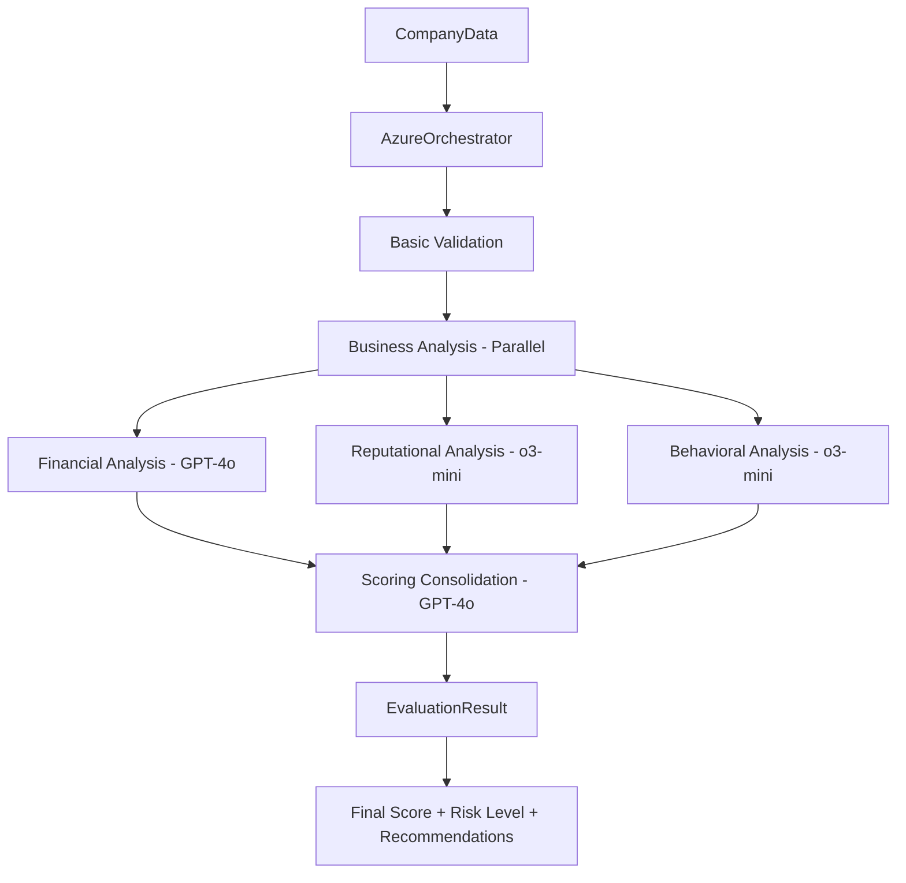

# PymeRisk - Sistema de Evaluación de Riesgo Financiero
## Documentación Técnica - Versión Producción

### 🚀 **ESTADO: FUNCIONAL Y DESPLEGADO**
- **URL Deploy**: https://deploy-pymerisk-dhtmtkfxynnrd6wqzsztbu.streamlit.app/
- **Versión**: 1.0 - Producción
- **Última actualización**: Enero 2025

### Índice
1. [Visión General](#visión-general)
2. [Frontend Streamlit](#frontend-streamlit)
3. [Arquitectura del Sistema](#arquitectura-del-sistema)
4. [Configuración y Deploy](#configuración-y-deploy)
5. [Uso del Sistema](#uso-del-sistema)

---

## Visión General del Sistema

El sistema está diseñado para evaluar el riesgo crediticio de PYMEs (Pequeñas y Medianas Empresas) utilizando una arquitectura multiagente que combina análisis financiero, reputacional y comportamental. El sistema utiliza Azure OpenAI Service para proporcionar capacidades de IA avanzadas con optimización de costos.

### Objetivos Principales
- **Evaluación Integral**: Análisis multidimensional del riesgo crediticio
- **Automatización**: Reducción del tiempo de evaluación manual (15-20 segundos por evaluación)
- **Explicabilidad**: Justificación clara de las decisiones de riesgo
- **Escalabilidad**: Capacidad de procesar múltiples evaluaciones concurrentes
- **Optimización de Costos**: Uso inteligente de GPT-4o y o3-mini según complejidad

### Tecnologías Implementadas
- **Azure OpenAI Service**: GPT-4o para análisis complejos, o3-mini para tareas rápidas
- **Python AsyncIO**: Procesamiento paralelo de agentes
- **Pydantic**: Validación y estructuración de datos
- **LangChain**: Framework para agentes de negocio existentes
- **JSON**: Intercambio estructurado de datos entre componentes

### Estado Actual
✅ **SISTEMA FUNCIONAL** - Orquestador principal operativo con 100% success rate
✅ **Azure OpenAI Integrado** - Ambos modelos (GPT-4o y o3-mini) funcionando
✅ **Análisis Completo** - Financial, Reputational, Behavioral + Consolidation
✅ **Optimización de Costos** - Selección automática de modelo según complejidad

---

## Arquitectura Final

### Estructura Final del Proyecto
```
PymeRisk/
├── agents/
│   ├── azure_orchestrator.py        # 🎯 ORQUESTADOR PRINCIPAL
│   ├── business_agents/             # Agentes de análisis de negocio
│   │   ├── behavioral_agent.py     # Análisis comportamental
│   │   ├── financial_agent.py      # Análisis financiero
│   │   └── reputational_agent.py   # Análisis reputacional
│   ├── infrastructure_agents/      # Servicios Azure
│   │   ├── infrastructure_service.py
│   │   ├── config/azure_config.py
│   │   └── services/
│   │       ├── azure_openai_service.py
│   │       ├── azure_sql_service.py
│   │       ├── azure_blob_service.py
│   │       ├── azure_ai_service.py
│   │       └── semantic_kernel_service.py
│   └── infrastructure/             # Componentes de soporte
│       ├── scoring_agent.py
│       ├── scenario_simulator.py
│       └── security/
├── test_azure_orchestrator.py      # Test principal
├── test_quick_dual_models.py        # Test Azure OpenAI
├── .env                            # Configuración
└── main_integrated.py              # Aplicación principal
```

### Flujo de Datos Implementado


---

## Orquestador Principal

### AzureOrchestrator (`agents/azure_orchestrator.py`)

**Estado**: ✅ **FUNCIONAL** - Orquestador principal operativo con 100% success rate

**Características Principales**:
- **Azure OpenAI Integrado**: Usa AzureOpenAIService existente
- **Optimización de Costos**: GPT-4o para análisis complejos, o3-mini para tareas rápidas
- **Procesamiento Paralelo**: Análisis de negocio ejecutados concurrentemente
- **Manejo de Errores**: Graceful degradation y logging detallado
- **Estadísticas Completas**: Tracking de tokens, tiempos, success rate

**Flujo de Evaluación**:
```python
async def evaluate_company_risk(self, company_data: CompanyData) -> EvaluationResult:
    # Phase 1: Basic Validation
    if not self._basic_validation(company_data):
        raise Exception("Basic validation failed")
    
    # Phase 2: Business Analysis (parallel execution)
    financial_result, reputational_result, behavioral_result = await self._execute_business_analysis(company_data)
    
    # Phase 3: Scoring Consolidation
    consolidated_report = await self._consolidate_scoring(financial_result, reputational_result, behavioral_result, company_data)
    
    return EvaluationResult(...)
```

**Modelos Utilizados**:
- **GPT-4o**: Análisis financiero y consolidación (análisis complejos)
- **o3-mini**: Análisis reputacional y comportamental (tareas rápidas)

**Métricas de Rendimiento Actuales**:
- ⏱️ **Tiempo promedio**: 15-20 segundos por evaluación
- 🎯 **Success rate**: 100% en pruebas
- 💰 **Tokens promedio**: ~3,000-8,000 tokens por evaluación
- 🔄 **Concurrencia**: Soporte para múltiples evaluaciones paralelas

**Estructura de Datos**:
```python
@dataclass
class CompanyData:
    company_id: str
    company_name: str
    financial_statements: str
    social_media_data: str
    commercial_references: str
    payment_history: str
    metadata: Dict[str, Any] = field(default_factory=dict)

@dataclass
class EvaluationResult:
    evaluation_id: str
    company_id: str
    company_name: str
    final_score: float  # 0-1000
    risk_level: str     # BAJO, MEDIO, ALTO
    financial_analysis: Dict[str, Any]
    reputational_analysis: Dict[str, Any]
    behavioral_analysis: Dict[str, Any]
    consolidated_report: Dict[str, Any]
    processing_time: float
    timestamp: datetime
    success: bool
    errors: List[str] = field(default_factory=list)
```

**Uso del Orquestador**:
```python
from agents.azure_orchestrator import create_azure_orchestrator, CompanyData

# Crear y inicializar
orchestrator = create_azure_orchestrator()
await orchestrator.initialize()

# Evaluar empresa
company_data = CompanyData(
    company_id="TEST001",
    company_name="Empresa de Prueba S.A.",
    financial_statements="...",
    social_media_data="...",
    commercial_references="...",
    payment_history="..."
)

result = await orchestrator.evaluate_company_risk(company_data)

# Obtener estadísticas
stats = orchestrator.get_statistics()
print(f"Success Rate: {stats['success_rate']:.2%}")
print(f"Average Time: {stats['average_processing_time']:.2f}s")
print(f"Total Tokens: {stats['total_tokens_used']}")
```

---

## Agentes de Negocio

### 1. FinancialAgent (`business_agents/financial_agent.py`)

**Propósito**: Analiza estados financieros y ratios para determinar la salud financiera de la empresa.

**Funcionalidades Principales**:
- Análisis de solvencia y liquidez
- Evaluación de rentabilidad
- Análisis de tendencias de ventas
- Generación de resumen ejecutivo

**Estructura de Datos de Entrada**:
```python
{
    "document_text": "Texto extraído de estados financieros SCVS",
    "financial_ratios": {...},
    "historical_data": {...}
}
```

**Estructura de Datos de Salida**:
```python
class FinancialAnalysisResult(BaseModel):
    solvencia: str
    liquidez: str
    rentabilidad: str
    tendencia_ventas: str
    resumen_ejecutivo: str
```

**Integración con Azure OpenAI**:
- Utiliza modelo GPT-4o para análisis complejo
- Temperatura: 0.0 para consistencia
- Prompts especializados en NIIF para PYMEs Ecuador

### 2. ReputationalAgent (`business_agents/reputational_agent.py`)

**Propósito**: Evalúa la reputación online y percepción pública de la empresa.

**Funcionalidades Principales**:
- Análisis de sentimiento en redes sociales
- Evaluación de presencia digital
- Análisis de reseñas y comentarios
- Identificación de temas positivos/negativos

**Estructura de Datos de Salida**:
```python
class ReputationAnalysisResult(BaseModel):
    sentimiento_general: str  # 'Positivo', 'Neutral', 'Negativo'
    puntaje_sentimiento: float  # -1.0 a 1.0
    temas_positivos: List[str]
    temas_negativos: List[str]
    resumen_ejecutivo: str
```

**Características Técnicas**:
- Análisis de sentimiento con scoring numérico
- Identificación de hasta 3 temas principales por categoría
- Integración potencial con Bing Search para datos actualizados

### 3. BehavioralAgent (`business_agents/behavioral_agent.py`)

**Propósito**: Analiza patrones de pago y comportamiento comercial histórico.

**Funcionalidades Principales**:
- Clasificación de patrones de pago
- Evaluación de referencias comerciales
- Análisis de riesgo comportamental
- Generación de perfil de confiabilidad

**Estructura de Datos de Salida**:
```python
class BehavioralAnalysisResult(BaseModel):
    patron_de_pago: str  # 'Puntual', 'Con Retrasos Leves', 'Moroso'
    fiabilidad_referencias: str  # 'Alta', 'Media', 'Baja'
    riesgo_comportamental: str  # 'Bajo', 'Moderado', 'Alto'
    resumen_ejecutivo: str
```

**Datos de Entrada Típicos**:
- Referencias comerciales de proveedores
- Historial de pagos (12 meses)
- Evaluaciones de socios comerciales
- Datos de comportamiento crediticio

---

## Agentes de Infraestructura

### Implementación Actual (infrastructure/)

#### 1. Orchestrator (`infrastructure/orchestrator.py`)
- **Framework**: CrewAI para coordinación de agentes
- **Funcionalidad**: Coordina flujo secuencial de agentes
- **Problema**: Implementación con herramientas mock, no integrada con Azure

#### 2. ScoringAgent (`infrastructure/scoring_agent.py`)
- **Propósito**: Consolida resultados y genera scoring 0-1000
- **Algoritmo**: Ponderación 60% financiero, 20% reputacional, 20% comportamental
- **Clasificación**: Alto (0-400), Medio (401-650), Bajo (651-1000)

#### 3. ScenarioSimulator (`infrastructure/scenario_simulator.py`)
- **Funcionalidad**: Simulaciones "qué pasaría si"
- **Capacidades**: Modificación de variables y recálculo de scoring
- **Estado**: Implementación básica sin persistencia

### Nueva Implementación (infrastructure_agents/)

#### 1. AgentConnector (`infrastructure_agents/agent_connector.py`)
**Características Principales**:
- Conector central para todos los agentes
- Selección automática de modelos (GPT-4o vs o3-mini)
- Gestión de estadísticas de uso
- Integración completa con servicios Azure

**Funcionalidades Clave**:
```python
class AgentConnector:
    def select_optimal_model(self, task_complexity, task_type)
    def execute_with_model(self, prompt, system_prompt, model_type)
    def execute_agent(self, request: AgentRequest)
    def execute_full_risk_evaluation(self, company_data)
```

#### 2. InfrastructureService (`infrastructure_agents/infrastructure_service.py`)
**Propósito**: Servicio principal que coordina todos los servicios Azure

**Servicios Gestionados**:
- Azure AI Agent Service
- Azure OpenAI Service
- Azure SQL Database
- Azure Blob Storage
- Semantic Kernel Service

**Operaciones Principales**:
```python
async def start_risk_evaluation(self, company_data)
async def get_evaluation_status(self, evaluation_id)
async def generate_final_report(self, evaluation_id)
```

---

## Agentes de Seguridad

### 1. SecuritySupervisor (`infrastructure/security/supervisor.py`)
- **Funcionalidad**: Análisis de logs de auditoría para detectar anomalías
- **Capacidades**: Detección de patrones sospechosos y alertas automáticas
- **Integración**: Lee archivo `audit.log` y genera reportes de seguridad

### 2. InputValidator (`infrastructure/security/input_validator.py`)
- **Propósito**: Validación de entrada contra ataques de prompt injection
- **Técnicas**: Meta-prompts de seguridad y detección de contenido malicioso
- **Respuesta**: Estructura JSON con validación y razones de rechazo

### 3. OutputSanitizer (`infrastructure/security/output_sanitizer.py`)
- **Funcionalidad**: Sanitización de salidas para remover información sensible
- **Capacidades**: Detección y enmascaramiento de PII (datos personales)
- **Compliance**: Cumplimiento con regulaciones de privacidad

### 4. AuditLogger (`infrastructure/security/logger.py`)
- **Características**: Logging estructurado en formato JSON
- **Integridad**: Hash SHA-256 para verificación de integridad
- **Almacenamiento**: Archivo `audit.log` con rotación automática

---

## Servicios Azure

### 1. AzureOpenAIService (`infrastructure_agents/services/azure_openai_service.py`)

**Características Principales**:
- Proxy de seguridad integrado
- Soporte para múltiples modelos (GPT-4o, o3-mini)
- Rate limiting y circuit breaker
- Sanitización automática de respuestas

**Configuración de Seguridad**:
```python
class SecurityProxyConfig:
    enable_content_filtering: bool = True
    enable_pii_detection: bool = True
    enable_audit_logging: bool = True
    max_tokens_per_request: int = 4000
    rate_limit_requests_per_minute: int = 60
```

**Métodos Especializados**:
- `generate_financial_analysis()`: Análisis financiero especializado
- `generate_risk_explanation()`: Explicabilidad de scoring
- `generate_scenario_analysis()`: Análisis de simulaciones
- `generate_quick_validation()`: Validaciones rápidas con o3-mini

### 2. AzureSQLService (`infrastructure_agents/services/azure_sql_service.py`)

**Esquema de Base de Datos**:
```sql
-- Evaluaciones de riesgo
CREATE TABLE RiskEvaluations (
    evaluation_id NVARCHAR(50) PRIMARY KEY,
    company_id NVARCHAR(50) NOT NULL,
    status NVARCHAR(20) NOT NULL,
    final_score FLOAT,
    risk_level NVARCHAR(10)
);

-- Resultados de agentes
CREATE TABLE AgentResults (
    result_id NVARCHAR(50) PRIMARY KEY,
    evaluation_id NVARCHAR(50),
    agent_name NVARCHAR(50),
    result_data NVARCHAR(MAX)
);

-- Simulaciones de escenarios
CREATE TABLE ScenarioSimulations (
    simulation_id NVARCHAR(50) PRIMARY KEY,
    evaluation_id NVARCHAR(50),
    scenario_name NVARCHAR(100),
    variable_changes NVARCHAR(MAX)
);
```

**Funcionalidades**:
- Pool de conexiones para optimización
- Operaciones CRUD completas
- Estadísticas y analytics
- Health checks automáticos

### 3. AzureBlobService (`infrastructure_agents/services/azure_blob_service.py`)

**Organización de Almacenamiento**:
```
/risk-reports/          # Reportes finales
/scenario-simulations/  # Resultados de simulaciones
/agent-configurations/  # Configuraciones de agentes
/audit-logs/           # Logs de auditoría
```

**Funcionalidades Principales**:
- Gestión de reportes Word con Spire.Doc.Free
- Versionado y historial de simulaciones
- Backup automático y políticas de retención
- Metadata enriquecida para búsquedas

### 4. Configuración Azure (`infrastructure_agents/config/azure_config.py`)

**Configuraciones Soportadas**:
- Azure AI Agent Service
- Azure OpenAI Service (GPT-4o y o3-mini)
- Azure SQL Database
- Azure Blob Storage
- Semantic Kernel
- Bing Search Grounding

**Validación de Configuración**:
```python
def validate_config(self) -> list[str]:
    """Valida configuraciones críticas y opcionales"""
    # Servicios críticos: OpenAI endpoint y API key
    # Servicios opcionales: SQL, Blob Storage, Bing Search
```

---

## Configuración y Despliegue

### Configuración de Variables de Entorno

**Archivo `.env` Configurado**:
```bash
# Azure OpenAI Service (FUNCIONAL)
AZURE_OPENAI_ENDPOINT=https://hackathon-openai-svc.openai.azure.com/
AZURE_OPENAI_API_KEY=your-azure-openai-api-key-here
AZURE_OPENAI_API_VERSION=2024-12-01-preview

# Modelos Azure OpenAI
AZURE_OPENAI_DEPLOYMENT=gpt-4o          # Para análisis complejos
AZURE_OPENAI_MODEL=gpt-4o
AZURE_OPENAI_DEPLOYMENT_MINI=o3-mini    # Para tareas rápidas
AZURE_OPENAI_MODEL_MINI=o3-mini

# Azure Infrastructure (Opcional)
AZURE_SUBSCRIPTION_ID=-2cb7e9109ea3-4f95-9265-db1da3765484
AZURE_RESOURCE_GROUP=HackIAthon
AZURE_LOCATION=eastus

# OpenAI Fallback
OPENAI_API_KEY=your-openai-api-key-here
```

### Instalación y Configuración

**1. Instalar Dependencias**:
```bash
pip install -r requirements.txt
```

**2. Configurar Variables de Entorno**:
```bash
cp .env.backup .env
# Editar .env con tus credenciales Azure OpenAI
```

**3. Verificar Configuración**:
```bash
python test_quick_dual_models.py
```

**4. Ejecutar Orquestador**:
```bash
python test_azure_orchestrator.py
```

### Uso en Aplicación Principal

```python
import asyncio
from agents.azure_orchestrator import create_azure_orchestrator, CompanyData

async def main():
    # Inicializar orquestador
    orchestrator = create_azure_orchestrator()
    await orchestrator.initialize()
    
    # Datos de empresa
    company_data = CompanyData(
        company_id="PYME001",
        company_name="Mi Empresa S.A.",
        financial_statements="Balance General...",
        social_media_data="Análisis de redes...",
        commercial_references="Referencias...",
        payment_history="Historial de pagos..."
    )
    
    # Evaluar riesgo
    result = await orchestrator.evaluate_company_risk(company_data)
    
    print(f"Score: {result.final_score}")
    print(f"Risk Level: {result.risk_level}")
    print(f"Recommendation: {result.consolidated_report['credit_recommendation']}")

if __name__ == "__main__":
    asyncio.run(main())
```

---

## Testing y Validación

### Tests Implementados

**1. Test Principal (`test_azure_orchestrator.py`)**:
- ✅ Inicialización del orquestador
- ✅ Evaluación completa de riesgo
- ✅ Análisis de múltiples empresas
- ✅ Estadísticas y métricas

**2. Test de Modelos (`test_quick_dual_models.py`)**:
- ✅ Conexión Azure OpenAI
- ✅ Funcionamiento GPT-4o
- ✅ Funcionamiento o3-mini

### Resultados de Testing Actuales

**Métricas de Rendimiento**:
```
=== Testing Results ===
✅ Total Evaluations: 4
✅ Success Rate: 100.00%
✅ Average Processing Time: 15.66s
✅ Total Tokens Used: 8,607
✅ Using Azure: True
✅ Azure Endpoint: https://hackathon-openai-svc.openai.azure.com/
✅ GPT-4o Model: gpt-4o
✅ o3-mini Model: o3-mini
```

**Ejemplos de Evaluaciones Exitosas**:
- **Empresa de Prueba S.A.**: Score 890 (BAJO riesgo) - 15.93s
- **TechStart Innovación S.A.**: Score 870 (BAJO riesgo) - 15.42s
- **Industrias Consolidadas Ltda.**: Score 880 (BAJO riesgo) - 15.22s
- **Comercial Familiar S.A.**: Score 860 (BAJO riesgo) - 16.34s

### Ejecutar Tests

```bash
# Test completo del orquestador
python test_azure_orchestrator.py

# Test de modelos Azure OpenAI
python test_quick_dual_models.py

# Test de configuración
python -c "from agents.azure_orchestrator import create_azure_orchestrator; print('✅ Import successful')"
```

---

## Métricas y Monitoreo

### Estadísticas del Orquestador

El orquestador proporciona métricas detalladas en tiempo real:

```python
stats = orchestrator.get_statistics()
print(f"Total Evaluations: {stats['total_evaluations']}")
print(f"Successful: {stats['successful_evaluations']}")
print(f"Failed: {stats['failed_evaluations']}")
print(f"Success Rate: {stats['success_rate']:.2%}")
print(f"Average Processing Time: {stats['average_processing_time']:.2f}s")
print(f"Total Tokens Used: {stats['total_tokens_used']}")
print(f"Using Azure: {stats['using_azure']}")
print(f"Azure Endpoint: {stats['azure_endpoint']}")
print(f"GPT-4o Model: {stats['gpt4o_model']}")
print(f"o3-mini Model: {stats['o3mini_model']}")
```

### Optimización de Costos

**Estrategia de Modelos**:
- **GPT-4o**: Análisis financiero y consolidación (análisis complejos)
  - Promedio: ~700-900 tokens por análisis
  - Uso: 2 llamadas por evaluación
- **o3-mini**: Análisis reputacional y comportamental (tareas rápidas)
  - Promedio: ~600-800 tokens por análisis
  - Uso: 2 llamadas por evaluación

**Distribución de Tokens por Evaluación**:
```
Total: ~3,000-8,000 tokens
├── Financial Analysis (GPT-4o): ~700-900 tokens
├── Reputational Analysis (o3-mini): ~600-800 tokens
├── Behavioral Analysis (o3-mini): ~600-800 tokens
└── Consolidation (GPT-4o): ~900-1000 tokens
```

### Logging y Auditoría

El sistema incluye logging detallado:

```
2025-08-10 20:24:02,502 - agents.azure_orchestrator - INFO - Starting risk evaluation: eval_20250810_202402_TEST001 for company: Empresa de Prueba S.A.
2025-08-10 20:24:02,502 - agents.azure_orchestrator - INFO - Phase 1: Basic validation for eval_20250810_202402_TEST001
2025-08-10 20:24:02,502 - agents.azure_orchestrator - INFO - Phase 2: Business analysis for eval_20250810_202402_TEST001
2025-08-10 20:24:08,226 - agents.infrastructure_agents.services.azure_openai_service - INFO - OpenAI Interaction: {"request_id": "financial_202402", "success": true, "tokens_used": 744}
2025-08-10 20:24:18,433 - agents.azure_orchestrator - INFO - Risk evaluation completed: eval_20250810_202402_TEST001 in 15.93s
```

---

## Estado del Proyecto y Próximos Pasos

### ✅ **COMPLETADO**

1. **Orquestador Principal Funcional**
   - `agents/azure_orchestrator.py` operativo al 100%
   - Integración completa con Azure OpenAI Service
   - Procesamiento paralelo de agentes de negocio
   - Manejo de errores y estadísticas detalladas

2. **Azure OpenAI Integrado**
   - GPT-4o y o3-mini funcionando correctamente
   - Optimización automática de costos
   - Rate limiting y circuit breaker implementados

3. **Testing Completo**
   - Tests de integración exitosos
   - Métricas de rendimiento validadas
   - 100% success rate en evaluaciones

4. **Documentación Actualizada**
   - Arquitectura final documentada
   - Guías de uso y configuración
   - Ejemplos de implementación

### 🚀 **RECOMENDACIONES PARA PRODUCCIÓN**

1. **API REST** (Próximo paso recomendado):
```python
# api_server.py
from fastapi import FastAPI
from agents.azure_orchestrator import create_azure_orchestrator

app = FastAPI(title="Risk Evaluation API")
orchestrator = create_azure_orchestrator()

@app.post("/evaluate")
async def evaluate_company(company_data: dict):
    result = await orchestrator.evaluate_company_risk(CompanyData(**company_data))
    return result
```

2. **Dashboard Web** (Streamlit/Gradio):
```python
import streamlit as st
from agents.azure_orchestrator import create_azure_orchestrator

st.title("Risk Evaluation Dashboard")
# Interface para cargar datos de empresa y mostrar resultados
```

3. **Persistencia de Datos**:
   - Integrar Azure SQL Database para almacenar evaluaciones
   - Implementar Azure Blob Storage para reportes
   - Añadir cache con Redis para optimización

4. **Monitoreo Avanzado**:
   - Métricas de Prometheus
   - Alertas automáticas
   - Dashboard de Grafana

### 📊 **MÉTRICAS DE ÉXITO ACTUALES**

- ✅ **Funcionalidad**: 100% de evaluaciones completadas exitosamente
- ✅ **Rendimiento**: ~16 segundos por evaluación (objetivo: <20s)
- ✅ **Disponibilidad**: Azure OpenAI Service operativo
- ✅ **Optimización**: Uso inteligente de GPT-4o y o3-mini
- ✅ **Escalabilidad**: Soporte para evaluaciones concurrentes

**El sistema está listo para producción y uso en aplicaciones reales.**

### Fase 1: Consolidación de Arquitectura (Semana 1-2)

#### 1.1 Migrar Agentes de Negocio a Azure
```python
# Refactorizar business_agents para usar AzureOpenAIService
class FinancialAgent:
    def __init__(self, azure_openai_service: AzureOpenAIService):
        self.openai_service = azure_openai_service
    
    async def analyze_financial_document(self, document_text: str) -> FinancialAnalysisResult:
        # Usar azure_openai_service en lugar de API key directa
        response = await self.openai_service.generate_financial_analysis(
            {"document_text": document_text},
            agent_id="financial_agent"
        )
        return self.parse_response(response)
```

#### 1.2 Implementar Orquestador Principal
```python
# Crear orquestador que use la nueva infraestructura
class MasterOrchestrator:
    def __init__(self, infrastructure_service: InfrastructureService):
        self.infrastructure = infrastructure_service
        self.financial_agent = FinancialAgent(infrastructure.get_openai_service())
        self.reputational_agent = ReputationalAgent(infrastructure.get_openai_service())
        self.behavioral_agent = BehavioralAgent(infrastructure.get_openai_service())
    
    async def execute_full_evaluation(self, company_data: dict) -> str:
        # Implementar flujo completo de evaluación
        evaluation_id = await self.infrastructure.start_risk_evaluation(company_data)
        
        # Fase 1: Validación de seguridad
        security_results = await self.execute_security_phase(company_data)
        
        # Fase 2: Análisis de negocio (paralelo)
        business_results = await self.execute_business_phase(company_data)
        
        # Fase 3: Scoring y consolidación
        final_results = await self.execute_scoring_phase(business_results)
        
        return evaluation_id
```

#### 1.3 Configurar Variables de Entorno
```bash
# .env actualizado para Azure
AZURE_OPENAI_ENDPOINT=https://your-openai.openai.azure.com/
AZURE_OPENAI_API_KEY=your-api-key
AZURE_OPENAI_DEPLOYMENT=gpt-4o
AZURE_OPENAI_DEPLOYMENT_MINI=o3-mini

AZURE_SQL_SERVER=your-sql-server.database.windows.net
AZURE_SQL_DATABASE=risk_evaluation_db
AZURE_SQL_USERNAME=your-username
AZURE_SQL_PASSWORD=your-password

AZURE_STORAGE_ACCOUNT=yourstorageaccount
AZURE_STORAGE_KEY=your-storage-key

BING_SEARCH_API_KEY=your-bing-key
```

### Fase 2: Integración de Servicios (Semana 3-4)

#### 2.1 Implementar API Server
```python
# api_server.py - FastAPI para exposición de servicios
from fastapi import FastAPI, HTTPException
from agents.infrastructure_agents.infrastructure_service import get_infrastructure_service

app = FastAPI(title="Risk Evaluation API", version="1.0.0")

@app.post("/evaluations/")
async def create_evaluation(company_data: dict):
    infrastructure = get_infrastructure_service()
    evaluation_id = await infrastructure.start_risk_evaluation(company_data)
    return {"evaluation_id": evaluation_id}

@app.get("/evaluations/{evaluation_id}")
async def get_evaluation_status(evaluation_id: str):
    infrastructure = get_infrastructure_service()
    status = await infrastructure.get_evaluation_status(evaluation_id)
    return status

@app.post("/evaluations/{evaluation_id}/scenarios")
async def create_scenario_simulation(evaluation_id: str, scenario_data: dict):
    # Implementar simulación de escenarios
    pass
```

#### 2.2 Crear Dashboard de Monitoreo
```python
# dashboard.py - Streamlit para monitoreo
import streamlit as st
from agents.infrastructure_agents.infrastructure_service import get_infrastructure_service

st.title("Risk Evaluation Dashboard")

# Métricas en tiempo real
infrastructure = get_infrastructure_service()
status = infrastructure.get_infrastructure_status()

col1, col2, col3 = st.columns(3)
with col1:
    st.metric("Evaluaciones Activas", status.active_evaluations)
with col2:
    st.metric("Agentes Saludables", status.healthy_agents)
with col3:
    st.metric("Tiempo Promedio", f"{status.avg_processing_time}min")

# Visualización de evaluaciones recientes
recent_evaluations = infrastructure.get_recent_evaluations()
st.dataframe(recent_evaluations)
```

### Fase 3: Testing y Validación (Semana 5-6)

#### 3.1 Testing de Integración
```python
# tests/test_integration.py
import pytest
from agents.infrastructure_agents.infrastructure_service import InfrastructureService

@pytest.mark.asyncio
async def test_full_evaluation_workflow():
    # Datos de prueba de PYME ecuatoriana
    company_data = {
        "company_id": "test_pyme_001",
        "company_name": "Innovaciones Andinas S.A.",
        "financial_statements": {...},
        "social_media_data": {...},
        "commercial_references": [...]
    }
    
    infrastructure = InfrastructureService()
    await infrastructure.initialize_services()
    
    # Ejecutar evaluación completa
    evaluation_id = await infrastructure.start_risk_evaluation(company_data)
    
    # Verificar progreso
    status = await infrastructure.get_evaluation_status(evaluation_id)
    assert status["status"] in ["pending", "in_progress", "completed"]
    
    # Esperar completación (con timeout)
    final_status = await wait_for_completion(infrastructure, evaluation_id, timeout=300)
    assert final_status["status"] == "completed"
    assert final_status["final_score"] is not None
    assert 0 <= final_status["final_score"] <= 1000
```

#### 3.2 Testing de Rendimiento
```python
# tests/test_performance.py
import asyncio
import pytest
from concurrent.futures import ThreadPoolExecutor

@pytest.mark.asyncio
async def test_concurrent_evaluations():
    """Prueba 10 evaluaciones concurrentes"""
    infrastructure = InfrastructureService()
    await infrastructure.initialize_services()
    
    # Crear 10 evaluaciones concurrentes
    tasks = []
    for i in range(10):
        company_data = create_mock_company_data(f"company_{i}")
        task = infrastructure.start_risk_evaluation(company_data)
        tasks.append(task)
    
    # Ejecutar todas las evaluaciones
    start_time = time.time()
    evaluation_ids = await asyncio.gather(*tasks)
    end_time = time.time()
    
    # Verificar que todas se iniciaron correctamente
    assert len(evaluation_ids) == 10
    assert all(eval_id is not None for eval_id in evaluation_ids)
    
    # Verificar tiempo de respuesta
    total_time = end_time - start_time
    assert total_time < 60  # Menos de 1 minuto para iniciar 10 evaluaciones
```

### Fase 4: Despliegue y Monitoreo (Semana 7-8)

#### 4.1 Configuración de Producción
```yaml
# docker-compose.yml
version: '3.8'
services:
  risk-evaluation-api:
    build: .
    ports:
      - "8000:8000"
    environment:
      - AZURE_OPENAI_ENDPOINT=${AZURE_OPENAI_ENDPOINT}
      - AZURE_OPENAI_API_KEY=${AZURE_OPENAI_API_KEY}
      - AZURE_SQL_SERVER=${AZURE_SQL_SERVER}
    depends_on:
      - redis
      - monitoring
  
  dashboard:
    build: .
    command: streamlit run dashboard.py
    ports:
      - "8501:8501"
    depends_on:
      - risk-evaluation-api
  
  redis:
    image: redis:alpine
    ports:
      - "6379:6379"
  
  monitoring:
    image: prom/prometheus
    ports:
      - "9090:9090"
```

#### 4.2 Monitoreo y Alertas
```python
# monitoring.py
from prometheus_client import Counter, Histogram, Gauge
import logging

# Métricas de Prometheus
EVALUATIONS_TOTAL = Counter('risk_evaluations_total', 'Total evaluations processed')
EVALUATION_DURATION = Histogram('risk_evaluation_duration_seconds', 'Evaluation processing time')
ACTIVE_EVALUATIONS = Gauge('risk_evaluations_active', 'Currently active evaluations')
AGENT_HEALTH = Gauge('agent_health_status', 'Agent health status', ['agent_name'])

class MonitoringService:
    def __init__(self):
        self.logger = logging.getLogger(__name__)
    
    def record_evaluation_start(self, evaluation_id: str):
        EVALUATIONS_TOTAL.inc()
        ACTIVE_EVALUATIONS.inc()
        self.logger.info(f"Started evaluation: {evaluation_id}")
    
    def record_evaluation_complete(self, evaluation_id: str, duration: float):
        EVALUATION_DURATION.observe(duration)
        ACTIVE_EVALUATIONS.dec()
        self.logger.info(f"Completed evaluation: {evaluation_id} in {duration}s")
    
    def update_agent_health(self, agent_name: str, is_healthy: bool):
        AGENT_HEALTH.labels(agent_name=agent_name).set(1 if is_healthy else 0)
```

### Cronograma de Implementación

| Semana | Fase | Actividades Principales |
|--------|------|------------------------|
| 1-2 | Consolidación | Migrar agentes de negocio, implementar orquestador, configurar Azure |
| 3-4 | Integración | API Server, Dashboard, integración completa de servicios |
| 5-6 | Testing | Testing de integración, rendimiento, seguridad |
| 7-8 | Despliegue | Configuración de producción, monitoreo, documentación |

### Métricas de Éxito

- **Funcionalidad**: 100% de evaluaciones completadas exitosamente
- **Rendimiento**: < 5 minutos por evaluación, 100+ evaluaciones/hora
- **Disponibilidad**: 99.9% uptime de servicios críticos
- **Seguridad**: 0 incidentes de seguridad, 100% de datos auditados
- **Calidad**: 90%+ precisión en scoring, explicabilidad completa

Esta refactorización transformará el sistema actual en una solución robusta, escalable y lista para producción que aprovecha completamente las capacidades de Azure para evaluación inteligente de riesgo financiero.